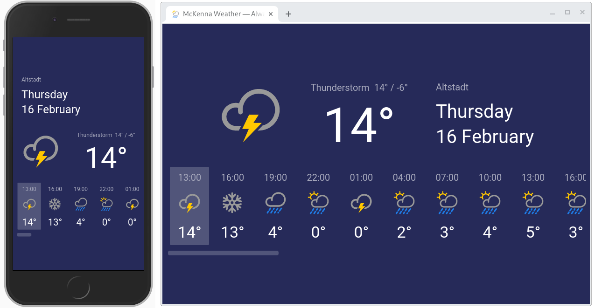

# McKenna Weather

> Rob McKenna is an ordinary lorry driver who can never get away from rain, and he has a log-book showing that it has rained on him every day, anywhere that he has ever been, to prove it.
> In the novel "So Long, and Thanks for All the Fish", Arthur suggests that he could show the diary to someone, which Rob does, making the media deem him a 'Rain God' (something which he actually is) for the clouds want "to be near him, to love him, to cherish him and to water him".

The McKenna Weather app always forecasts rain, no matter where you are. Real weather forecast data is retrieved from [OpenWeather](https://openweathermap.org/), with sunny entries happily replaced with various types of precipitation.



## Running locally

First, start the API server (requires [Go](https://golang.org/)):

```bash
cd api/
go run server.go
```

Then set-up and start the React development server:

```bash
cd client/
npm install
npm start
```

The app will be served at [localhost:3000](http://localhost:3000/) by default


## Testing

The Jest-based client-side tests may be run with:

```bash
cd client/
npm test
```

## Source formatting

All frontend code is formatted with [Prettier](https://prettier.io/), which can be invoked with:

```bash
cd mckenna-weather/
npm run pretty
```
